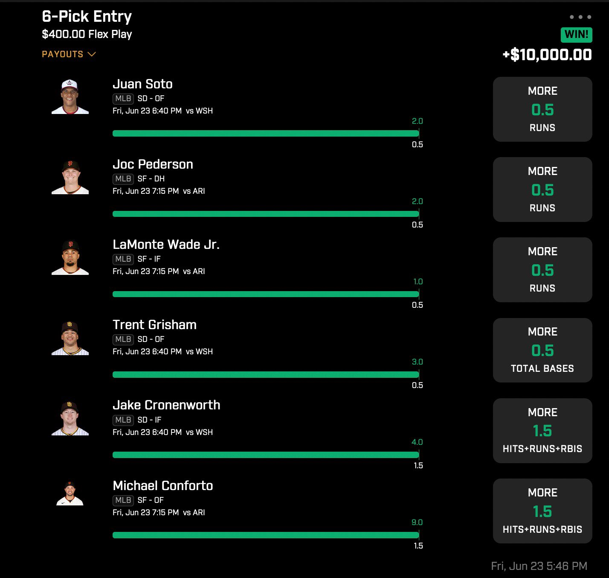

# Prizepicks

I’ve been betting seriously on PrizePicks for a while now. At first glance, I simply thought it didn’t match my betting style. If you know me, I am hardly the type to make 4, 5 and 6 leg parlays, so the whole concept kind of went against my instincts. However, over time I have picked up on some clear edges, and some concepts that translate to the other DFS apps as well. I have made over **$70,000 profit** on PrizePicks alone, so safe to say I know what I’m talking about. Let’s start with with the best concept on these apps

* CORRELATION. If you follow me, you’ve heard me talk about correlation before. In sports, it almost always refers to having two or more props that work together, and that can be accomplished at the same time. The easiest example of this for me is taking a quarterbacks passing yards and also taking one of his receiver’s yards. The idea is simple. QB throw football, WR catch football, the stats count for both players, few word do trick.

The reason correlation is so important on PrizePicks, is usually sportsbooks take away odds when they see that your plays correlate like this. However, that is not a factor on PrizePicks. All entries pay the same amount of \$$$ based on the number of legs you use. What does this mean? **IT MEANS YOU SHOULD MATHEMATICALLY ALWAYS CORRELATE YOUR PLAYS ON THIS APP** I want to stress this point to you. If you like money, you are 100% inclined to take props that work together and tell a story on PrizePicks. Here are the best methods to use per sport: NBA – One player’s assists, combined with points props or threes props from people on the same team. Preferably all starters. NFL – QB to WR, easy MLB – We’ve seen this in action recently. Take the runs props from players in the top of the order, and take either HRR or total bases from a player that bats one or two spots behind your “runs prop” players

I have tried many ways on PrizePicks. I have tried to build slips by finding the best lines compared to other books. That has mild success to it, but by far the best way is to correlate your picks, and to build only **5 or 6 pick plays**. The EV math supports this. Study correlation, love it, make it your best friend. Let the 25x’s rain heavy

I think the best format is to stack two teams together. So if you were doing a 6 pick play, I would try to build two correlated stacks of three.

This way you basically need two teams to do a lot, instead of needing 6 individual players to do a lot

Here’s a good example, 3 Giants players and 3 Padres players. Nice and easy 25x.

<figure><figcaption></figcaption></figure>
